# BellaTry Frontend

This is the frontend application for BellaTry, built with Next.js, TypeScript, and Tailwind CSS.

## Layout & Core UI Structure

BellaTry uses a robust, modular layout system designed for multi-language support and future extensibility.

### Layout System
- **Centralized Layout:** All pages are wrapped in a shared layout (`src/components/layout/Layout.tsx`) via `src/app/[locale]/layout.tsx`.
- **Header:** Navigation, logo, and auth state are handled in `src/components/layout/Header.tsx`.
- **Footer:** Global footer in `src/components/layout/Footer.tsx`.
- **Global Boundaries:** Error and loading boundaries are provided by `src/components/layout/ErrorBoundary.tsx` and `LoadingSpinner.tsx`.
- **Color System:** All styling uses theme tokens from Tailwind config. See [`docs/COLOR_SYSTEM.md`](docs/COLOR_SYSTEM.md).

### Adding Pages
- Add new pages under `src/app/[locale]/<page>/page.tsx`.
- All pages automatically use the shared layout and color system.
- Example placeholder pages: Home, Watchlist, Chat, News, Dashboard.

### Responsive Design
- All layout and navigation are fully responsive using Tailwind classes from the config.

### Colocated Tests
- All component and layout tests are colocated with their components (e.g., `src/components/layout/__tests__/`).
- Tests cover rendering, navigation, and accessibility.

## Getting Started

### Prerequisites

- Node.js 18.x or later
- npm or yarn

### Installation

1. Clone the repository
2. Install dependencies:
   ```bash
   npm install
   # or
   yarn install
   ```

3. Create a `.env.local` file in the root directory and add the following environment variables:
   ```
   NEXT_PUBLIC_SUPABASE_URL=your-supabase-project-url
   NEXT_PUBLIC_SUPABASE_ANON_KEY=your-supabase-anon-key
   NEXT_PUBLIC_API_URL=http://localhost:3001
   ```

### Development

Run the development server:

```bash
npm run dev
# or
yarn dev
```

Open [http://localhost:3000](http://localhost:3000) with your browser to see the result.

### Testing

Run the test suite:

```bash
npm test
# or
yarn test
```

### Building for Production

```bash
npm run build
# or
yarn build
```

### Running in Production

```bash
npm start
# or
yarn start
```

## Project Structure

```
src/
├── app/                # Next.js app directory (multi-locale)
│   └── [locale]/       # Per-locale routing and pages
├── components/
│   └── layout/         # Layout, Header, Footer, ErrorBoundary, LoadingSpinner
├── styles/             # Global styles and Tailwind CSS
├── lib/                # Library code and API clients
├── hooks/              # Custom React hooks
├── context/            # React context providers
```

See also: [UI Components Documentation](docs/UI_COMPONENTS.md)

## Authentication User Journey

The following diagram illustrates the user authentication flow for TradeAdvisor:



**What this shows:**
- Users can sign up or log in using either email/password or Google (OAuth) via Supabase.
- After authentication, the user's session is managed in context, granting access to the main app features (Watchlist, Chat, News Feed, Dashboard).

For more details, see the planning documentation in `../../PLANNING.md`.

## Technologies Used

- Next.js 14
- TypeScript
- Tailwind CSS
- Jest
- React Testing Library
- ESLint
- Prettier

## Password Reset & SMTP (Email) Configuration

**How password reset emails work in TradeAdvisor:**

- The frontend does NOT send emails directly and does NOT require SMTP credentials.
- When a user requests a password reset, the frontend calls Supabase Auth's password reset API using the Supabase JS client.
- Supabase is responsible for sending the password reset email.
- **SMTP credentials must be configured in the Supabase dashboard:**
  - Go to Supabase Dashboard → Auth → Settings → SMTP.
  - Enter your SMTP host, port, user, pass, and from address.
- The frontend only needs public Supabase keys in `.env.local`.
- Do NOT add SMTP credentials to `.env.local` or commit them to the frontend repo.

**If you ever build a custom backend email system,** SMTP credentials should be set in the backend's `.env` and CI/CD secrets, NOT in the frontend.

## Centralized API Client & Authenticated Requests

TradeAdvisor uses a centralized, shared `ApiClient` instance for all authenticated API requests. This ensures:
- All API services (watchlist, news, user, etc.) use the same logic for authentication headers.
- The Supabase JWT is always included in the `Authorization` header when the user is logged in.
- If the authentication logic changes, you only update it in one place (`ApiClient`).

### How it works
- The `ApiClient` is created via the `getApiClient(getAccessToken)` function, which takes a getter for the current access token (from React context).
- All API services (e.g., `createWatchlistApi`) use this shared client for requests.
- This pattern is recommended for all future API services.

**Example:**
```ts
import { getApiClient } from './core/apiClient';
import { useAuth } from '../hooks/useAuth';

export function createMyApi() {
  const { accessToken } = useAuth();
  const api = getApiClient(() => accessToken);
  // ... use api for requests
}
```

See `src/api/services/watchlist.ts` for a full example.

## Chat UI Architecture (Iteration 4)

This section documents the architecture and design for the Chat Interface & Stock Analysis feature (see [PLANNING.md](../PLANNING.md#iteration-4-chat-interface--stock-analysis)).

### Component Structure
- **ChatContainer**: Main chat interface (handles state, API calls, error/loading)
- **ChatMessageList**: Displays list of messages (user & AI)
- **ChatInput**: User input box and send button
- **ChatMessage**: Renders a single message (user or AI, styled accordingly)
- **(Optional) ChatToolbar**: For future features (multi-ticker, shortcuts)

All components are modular and colocated with their tests.

### State Management
- React state (or context if needed) for:
  - Message history (array of `{role: 'user'|'ai', content: string, ...}`)
  - Loading state (pending message)
  - Error state (for toasts/UI feedback)
- Optimistic UI: Show user message immediately, show loading spinner for AI response.

### API Integration
- On send, POST to `/api/ai/analyze` with tickers and query.
- Show AI response in chat when received.
- Handle errors with toast (use new variants).

### Styling & Theming
- Use only Tailwind classes from your config and color system.
- User and AI messages visually distinct (e.g., background, alignment).
- Responsive and accessible (keyboard navigation, ARIA labels).

### Keyboard Shortcuts
- Enter to send, Shift+Enter for newline.
- (Future) Add more shortcuts as needed.

### Testing
- Colocate unit and integration tests with each component.
- Test message sending, error handling, and UI states.

### ASCII Diagram
```
+-----------------------------+
|      ChatContainer          |
|  +-----------------------+  |
|  |  ChatMessageList      |  |
|  |  +-----------------+  |  |
|  |  | ChatMessage     |  |  |
|  |  +-----------------+  |  |
|  +-----------------------+  |
|  +-----------------------+  |
|  |  ChatInput           |  |
|  +-----------------------+  |
+-----------------------------+
```

### Authentication & Demo Logic
- Only logged-in users can use the chat continuously.
- Unauthenticated users can send one message as a demo, then are prompted to log in or sign up to continue.
- The frontend sends the X-API-KEY header (from NEXT_PUBLIC_API_KEY) with all chat/AI requests. 